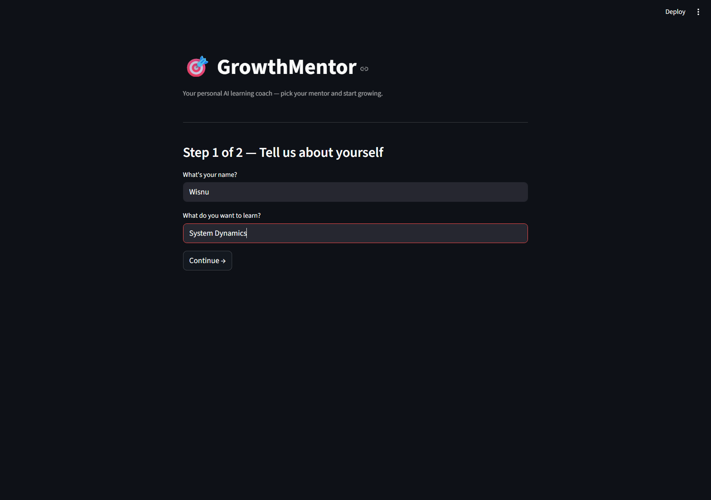
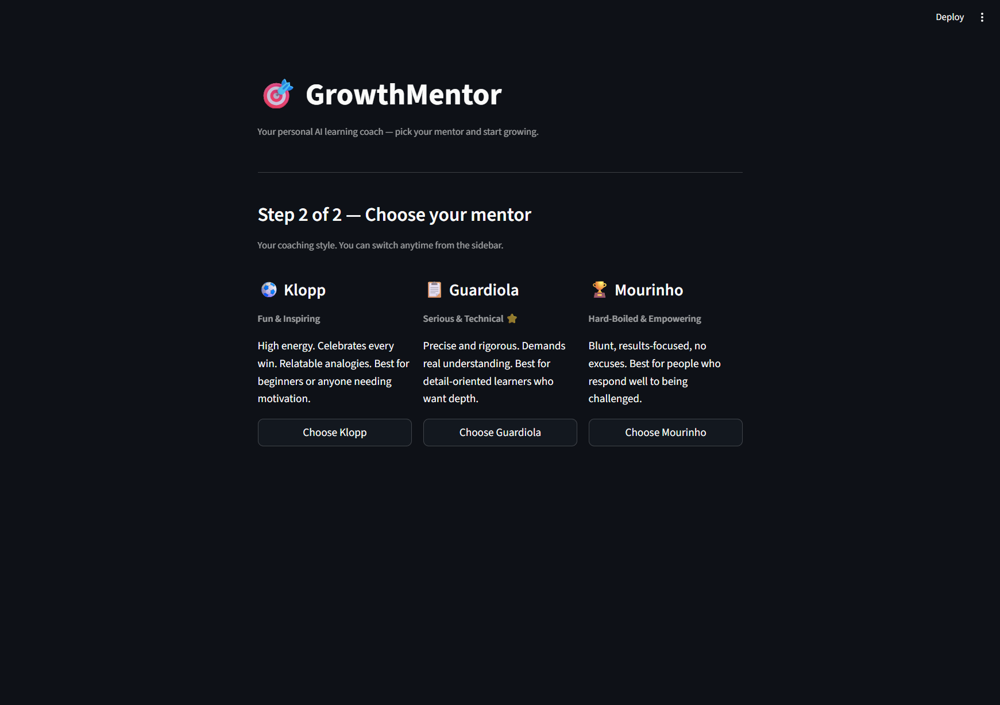
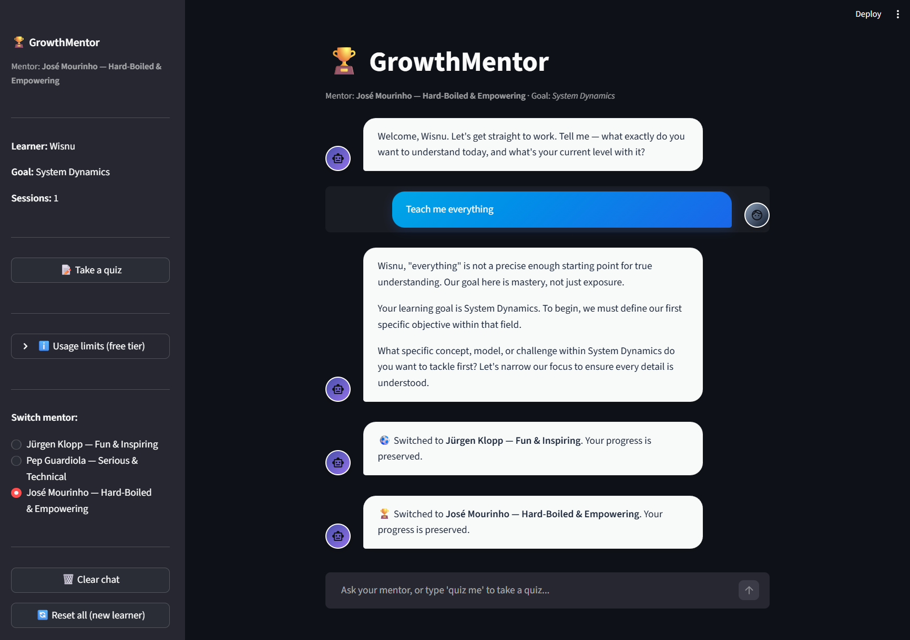
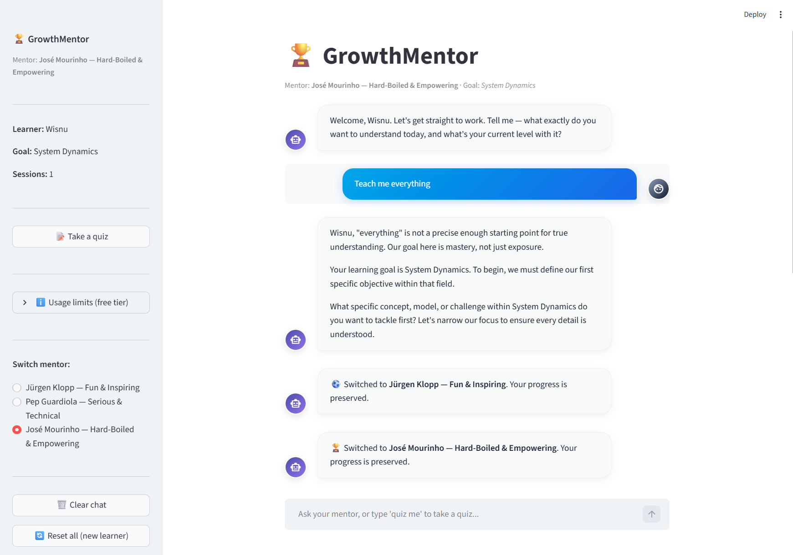
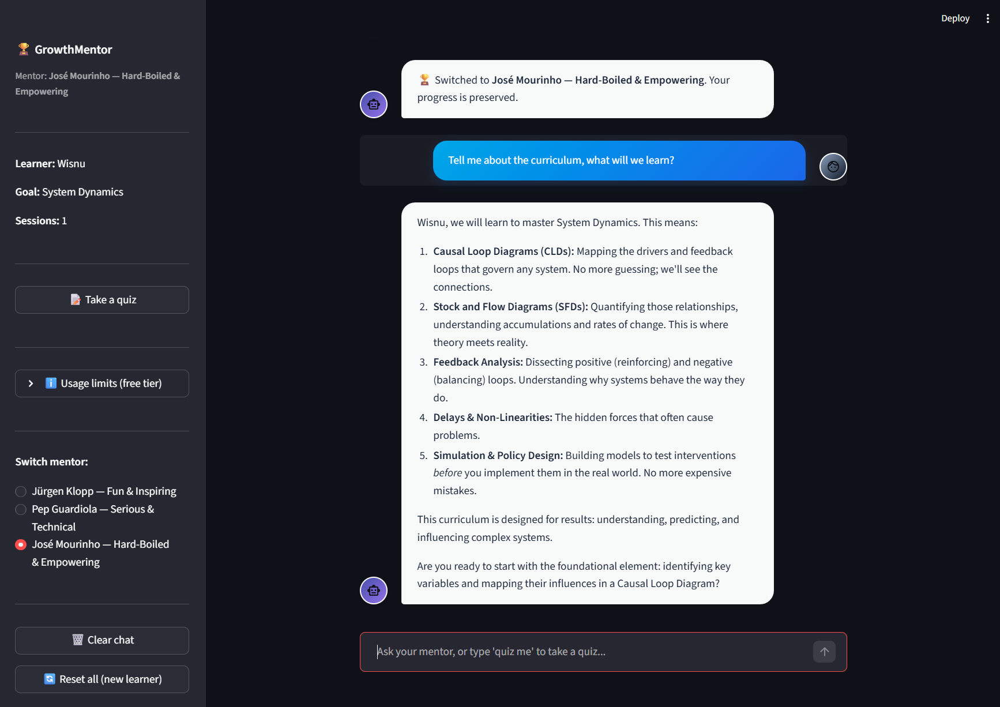

# GrowthMentor 🎯

A personal AI learning coach powered by **Gemini 2.5 Flash** and **Streamlit**.

Choose your coaching persona, define your learning goal, and get coached through any subject with memory that grows across your session, a quiz engine that tests your knowledge, and a progress tracker that shows your confidence evolving in real time.

---

## Features

| Feature | Detail |
|---|---|
| **3 mentor personas** | **Klopp** (fun & inspiring), **Guardiola** (serious & technical), **Mourinho** (hard-boiled & empowering) |
| **Conversational memory** | Remembers your name, goal, topics covered, and confidence per topic across the session |
| **Google Search Grounding** | Gemini searches the web automatically for time-sensitive topics |
| **Quiz engine** | Generates 3-question MCQ quizzes on your current topic,  type "quiz me" or use the sidebar button |
| **Progress tracking** | Accuracy bar, milestone badges, confidence scores per topic |
| **Prompt hardening** | Injection detection, domain lock, sanitization |
| **Safe error handling** | Every API error surfaces a specific, actionable message |

---

## Project Structure

```
growthmentor/
├── app.py                  # Streamlit entry point: routing, UI, chat, quiz
├── requirements.txt        # Pinned dependencies
├── .env.example            # API key template (safe to commit)
├── .env                    # Your real key — NEVER commit this
├── .gitignore
│
├── core/
│   ├── gemini_client.py          # Gemini API connection — generate_response()
│   ├── prompt_builder.py         # Persona prompts + memory injection + security block
│   ├── quiz_engine.py            # Quiz generation, parsing, scoring, result messages
│   └── safety_filter.py          # Sanitization, injection detection, domain guard
│
└── memory/
    ├── profile.py                # UserProfile Pydantic model + quiz stats
    ├── session.py                # st.session_state helpers
    └── updater.py                 # Hybrid memory extraction (rule-based + Gemini)
```

---
## Reproducibility

### 1. Clone the repo
```bash
git clone https://github.com/wapratama/growth-mentor.git
cd growth-mentor
```

### 2. Create a virtual environment

```bash
# macOS / Linux
python -m venv venv && source venv/bin/activate

# Windows
python -m venv venv
venv\Scripts\activate
```

### 3. Install dependencies

```bash
pip install -r requirements.txt
```

### 4. Add your API key

```bash
cp .env.example .env
```

Open `.env` and replace the placeholder:

```
GEMINI_API_KEY="your_key_here"
```

Get a free key at: https://aistudio.google.com/app/apikey

### 5. Run the app

```bash
streamlit run app.py
```

Opens at `http://localhost:8501`.

### 6. Deploying to Streamlit Community Cloud (free)

1. Push your repo to GitHub (make sure `.env` is in `.gitignore`)
2. Go to https://share.streamlit.io → **New app** → select your repo → `app.py`
3. In **Advanced settings → Secrets**, add:
   ```toml
   GEMINI_API_KEY = "your_key_here"
   ```
4. Click **Deploy** — live in ~60 seconds

---

## AI Chatbot UI

**1. Onboarding**: Input your name, learning goal, and choose your mentor





**2. Landing Page**: Dark and light mode




**3. Chat Mode**: Test response



---

## Model and usage limits

| Property | Value |
|---|---|
| Model | `gemini-2.5-flash` |
| Knowledge cutoff | January 2025 |
| Requests / minute (RPM) | 5 (Free Tier Limit) |
| Requests / day (RPD) | 20 (Free Tier Limit) |
| Input tokens / minute | 250,000 (Free Tier Limit) |
| Web search grounding | Enabled (uses same quota) |

**RPD strategy used in this project:**

- Every chat message = **1 API call**
- Memory extraction = **1 API call every 3 messages** (not every message)
- Every quiz = **1 API call** (user-triggered only, never automatic)

This means ~10 full chat exchanges + ~3 quizzes = ~16 total API calls/day on the free tier.

---

## Architecture overview

```
User message
     │
     ▼
Safety filter ──► BLOCKED → show warning, stop
     │ safe
     ▼
Quiz intent? ──► YES → generate_quiz() → quiz UI
     │ no
     ▼
build_system_prompt()
  = persona prompt
  + memory context (topics, confidence, summary)
  + security block
     │
     ▼
generate_response()  ←──── Google Search (if time-sensitive)
     │
     ▼
Display response
     │
     ▼
update_memory()
  = rule_based_update()      (every message, free)
  + gemini_memory_update()   (every 3rd message, 1 API call)
     │
     ▼
save_profile() → st.session_state
```

---

## Mentor personas

| Persona | Style | Best for |
|---|---|---|
| ⚽ **Jürgen Klopp** | Fun, warm, high energy | Beginners, anyone needing motivation |
| 📋 **Pep Guardiola** | Precise, rigorous, Socratic | Detail-oriented learners who want depth |
| 🏆 **José Mourinho** | Blunt, results-focused, no excuses | Learners who respond to challenge |

Switch mentor anytime from the sidebar — all progress is preserved.

---

## Security

- API key: stored in `.env` (local) or Streamlit Secrets (deployed), never in code
- Prompt injection: 14 pattern categories detected and hard-blocked before any API call
- Input sanitization: control characters stripped, length enforced (2–1000 chars)
- System prompt: security hardening block injected last on every call
- Domain lock: mentor persona and system prompt redirect off-topic questions
- No user data is sent anywhere except the Gemini API

---

## Tech Stack

- [Gemini 2.5 Flash](https://deepmind.google/technologies/gemini/) — Google's fast, efficient LLM
- [Streamlit](https://streamlit.io) — Python-native web UI
- [Google AI Studio](https://aistudio.google.com) — API key management
- [Pydantic](https://docs.pydantic.dev) — data validation
- [python-dotenv](https://pypi.org/project/python-dotenv/) — environment variable management

---

## License

**MIT License** — free to use, fork, and build on.

---

## Author
**Wisnu Anugrah Pratama**
- Email: wisnuanugrahpratama@gmail.com
- GitHub: https://github.com/wapratama
- LinkedIn: [Wisnu Anugrah Pratama](https://www.linkedin.com/in/wisnu-anugrah-pratama/)

> **Notes:** _Reach me for any feedback or collaboration. Let's grow together!_

---